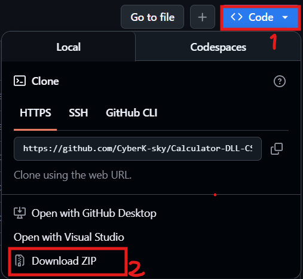

# Calculator-DLL-CSharp
Its is a persian version of a simple DLL of C# about calculator.

---------------------------------------------------------------------------------------------------

1. برای نصب کتابخانه با [عکس ها](/Pics) به ترتیب مراحل نصب رو پیش بروید داخل پوشه
2. برای استفاده از کد های تست محتوات [فایل](test_code.txt) را داخل پروژه بریزید   
3. برای توضیح توابع به این [فایل](manual.txt) مراجعه کنید 
باتشکر

در صورت بروز مشکل و یا پیدا کردن باگ در کد در تلگرام ما را خبر کنید @Its_Ksky

برای نصب فایل ها:

